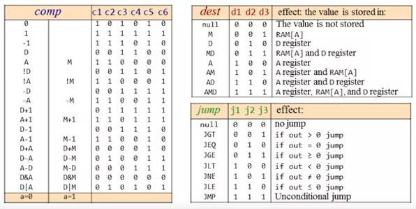
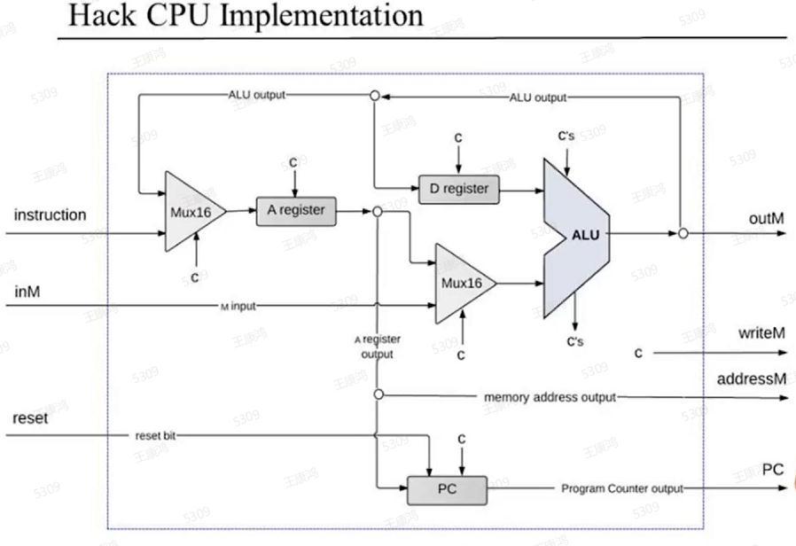
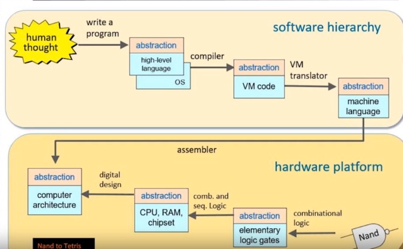

- [HARDWARE OF HACK](#hardware-of-hack)
  - [architecture](#architecture)
  - [Boolean Functions and Gate Logic](#boolean-functions-and-gate-logic)
  - [Boolean Arithmetic and The ALU](#boolean-arithmetic-and-the-alu)
  - [Sequential Logic and memory](#sequential-logic-and-memory)
  - [Machine Language](#machine-language)
    - [hack machine language(Symbolic syntax)](#hack-machine-languagesymbolic-syntax)
    - [hack machine language(Binary syntax)](#hack-machine-languagebinary-syntax)
    - [Peripheral I/O device](#peripheral-io-device)
    - [The hack assembly lauguage features](#the-hack-assembly-lauguage-features)
  - [Computer Architecture](#computer-architecture)
    - [Hack Computer](#hack-computer)
    - [Central Processing Unit](#central-processing-unit)
    - [PC function](#pc-function)
    - [Memory](#memory)
  - [Assembler](#assembler)
    - [Initialization](#initialization)
    - [First pass](#first-pass)
    - [Second pass](#second-pass)
- [SOFTWARE OF HACK](#software-of-hack)
  - [architecture](#architecture-1)
  - [Jack language](#jack-language)
    - [Jack Grammar](#jack-grammar)
    - [Jack complie](#jack-complie)
    - [Jack OS API](#jack-os-api)
  - [VM code:stack mechine](#vm-codestack-mechine)
    - [Arithmetic/Logical commands(true:-1,false:0)](#arithmeticlogical-commandstrue-1false0)
    - [Memory segments commands](#memory-segments-commands)
    - [Branching commands](#branching-commands)
    - [Function commands](#function-commands)

# HARDWARE OF HACK

## architecture

- <image src="./resourse/images/raodmap.png" width="700" height="500">

## Boolean Functions and Gate Logic

## Boolean Arithmetic and The ALU

- ALU operation table  
  

## Sequential Logic and memory

## Machine Language

### hack machine language(Symbolic syntax)

- Types of register
  - A register:A holds a 16-bit value
  - D register:D holds a 16-bit value
  - M register:M represents the 16-bit RAM register addressed by A (M=RAM[A])
- Syntax of the A-instruction:
  - Sytax:**@value**
  - Effect:
    - Sets the A register to value(A=value)
    - Select RAM[A] register(M=RAM[A])
- Syntax of the C-instruction:
  - Sytax:**dest=comp;jump**(both dest and jump are optional)
  - Effect:
    - Compute the value of comp
    - Stores the result in dest
    - If (comp jump 0) jump to execute the instruction stored in M[A]
  - comp:computation field
    - 0,1,-1,D,A!D,!A,-D,-A,D+1,A+1,D-1,A-1,D+A,D-A,A-D,D&A,DA,IM,-M,M+1,M-1,D+M,D-M,M-D,D&M,D|M
  - dest:where to store the result of the computation(can simultaneously store the result of the computations in more than one container)
    - null,M,D,MD,A,AM,AD,AMD
  - jump:jump condition base on the result of computation
    - null,JGT,JEQ,JGE,JLT,JNE,JLE,JMP
- Examples:
  - Set the D register to -1:
    ```
    D=-1
    ```
  - Set M[300] to the value of the D register minus 1:
    ```
    @300 //A=300
    M=D-1 //RAM[300]=D-1
    ```
  - If (D-1==0) jump to execute the instruction stored in ROM[56]
    ```
    @56 //A=56
    D-1;JEQ
    ```

### hack machine language(Binary syntax)

- Syntax of the A-instruction:
  - Sytax:**1-bit(default 0 mean C-instruction) 15-bit(value is a 15-bit binary number)**
  - Example:
    - Symbolic syntax:@21
    - Binary syntax:0000000000010101
- Syntax of the C-instruction:
  - Sytax:**1-bit(default 1 mean C-instruction) 2-bits(not used,defalut 11) 7-bits(comp bits) 3-bits(dest bits) 3-bits(jump bits)**
  - Reflect table  
    
  - Example:
    - Symbolic syntax:M=1
    - Binary syntax:1 11 01111111 001 000

### Peripheral I/O device

- Keyboard
  - keyboard memory:16-bits register,adress:24576
  - When a key is pressed on the keyboard, the key's scan code appears in the keyboard memory map
  - the hack character set  
    
  - Example:
    - HardwareSimulator
    - builtin chip:Keyboard
- Screen
  - screen memory map:(one bit in memory control one pixel on/off)
    - memory:16-bits \* 8192=131072 pixels
    - Display unit:consisting of 256 rows pixels,512 columns pixels,total:256\*512=131072 pixels
  - To set pixel(row,col) on/off:
    - adress=RAM[16384+32*row+col/16],bit=(col%16)
  - Example:
    - HardwareSimulator
    - builtin chip:Screen

### The hack assembly lauguage features

- built-in symbols
  symbol value
  R0 0
  R1 1
  ... ...
  R15 15
  SCREEN 16384
  KBD 24576
  SP 0
  LCL 1
  ARG 2
  THIS 3
  THAT 4

- symbolic references
  - declaring a lable:`(LABLE)`
    - when @LABLE,it mean @n(n is the address of `(LABLE)`)
  - using a lable:`@LABLE`
    - Branching symbol:If LABLE has corresponding lable declaration,equal to `@n`(n is the address of `(LABLE)`)
    - Variable symbol:If LABLE has no corresponding lable declaration,equal to `@n`(n is the RAM address of variable LABLE)

## Computer Architecture

### Hack Computer

- Hack Computer
  

### Central Processing Unit

- CPU
  

### PC function

- PC function
  

### Memory

- data memory  
  
- instruction memory:just a ROM32K memory

## Assembler

### Initialization

- Init the symbol table and add the pre-defined symbols

### First pass

- For each line
  - Deal the space
  - Deal the comment
  - Deal the blank line
  - Add the label symbols

### Second pass

- Set the address to 16
- For each instruction1
  - A-instruction
    - deal with the @labelSymbol
      - If (symbol,value) is found
      - If not found:
        - Add (symbol,address) to the table
        - Use address to complete the instruction's translation
        - address++
    - Write the binary code to the output file
  - C-instruction
    - Parse the instruction
    - For each field in the instrucion,generate the corresponding binary code
    - Write the binary code to the output file

# SOFTWARE OF HACK

## architecture

- 
- Jack lauguage->**Jack compiler**->  
  VM code(VMEmulator)->**VMTranslator**->  
  Assmbly code(CPUEmulator)->**Assmbler**->  
  Binary code(HardwareSimulator) 
- Function in stack
  - 
- Booting
  - bootstrap call Sys.init
  - Sys.int call main(Main.vm has main function)
    ```
    //Bootstrap code(should be written in assembly and beginning in address zero)
    SP=261
    Call Sys.init
    ```
- Standard mapping of the VM on the Hack platform  
  


## Jack language

### Jack Grammar

- Lexical elements
  - **keyword**:
`'class'|'constructor'|'function'|'method'|'field'|'static'|
var'|'int'|'char'|'boolean'|'void'|'true'|'false'|'null'|'this'
|'let'|'do'|'if'|'else'|'while'|'return'`
  - **symbol**:`'{' '}' '(' ')' '[' ']' '.' ',' ';' '+' '-' '*' '/' '&' '|' '<' '>' '=' '~'`
  - **integerConstant**:a decimal number in the range 0...32767.
  - **StringConstant**:a sequence of Unicode characters not including double quote or newline
  - **identifier**:a sequence of letters,digits,and underscore ('_') not starting with a digit.
- Program structure 
  - A Jack program is a collection of classes,each appearing in a separate file,and each compiled separately.Each class is structured as follows:
  - **class**:`class className{classVarDec* subroutineDec*}`
  - **classVarDec**:`('static'|'field') type varName (','varName)*';`
  - **type**:`'int' 'char' 'boolean' 'className'`
  - **subroutineDec**:`('constructor'|'function'|'method) ('void'|type) subroutineName(parameterList) subroutineBody`
  - **parameterList**:`((type varName)(','type varName)*)?`
  - **subroutineBody**:`{varDec* statements}` 
  - **varDec**:`var type varName (','varName)*;`
  - **className**:identifier
  - **subroutineName**:identifier
  - **varName**:identifier
- Statements
  - **statements**:statement*
  - **statement**:letStatement | ifStatement | whileStatement | doStatement | returnStatement
  - **letStatement**:`let varName ([expression])?=expression;`
  - **ifStatement**:`if (expression) {statements} (else {statements})?`
  - **whileStatement**:`while (expression) {statements}`
  - **doStatement**:`do subroutineCall;`
  - **returnStatement**:`return expression?;`
- Expression
  - **expression**:term(op term)*
  - **term**:`integerConstant | stringConstant | keywordConstant | varName | varName[expression] | subroutineCall | (expression) | unaryOp term`
  - **subroutineCall**:`subroutineName(expressionList) |  
(className|varName).subroutineName(expressionList)`
  - **expressionList**:`(expression (','expression)*)?`
  - **op**:`+  -  *  /  &  <  >  =`
  - **unaryOp**:`- | ~`
  - **keywordConstant**:`true | false | null | this`

### Jack complie

- Compiler development roadmap
  
- JackAnalyzer
  - Input:`JackAnalyzer fileName.jack | directoryName`
  - Output:`fileName.xml | .xml file for every .jack file`
  - JackTokenizer
    - Ignores all comments and white space in the input stream,and hand tokens according to **Lexical elements**
    - API 
      - `constructor(input file/stream)`:Opens the input .jack file and gets ready to tokenize it.
      - `boolean hasMoreTokens()`:Are there more tokens in the input?
      - `void advance()`:If hasMoreTokens is true,gets the next token frome the input and makes it the current token.
      - `LexicalType tokenType()`:Returns the type of the current token,as a constant.
      - `string keyword()`:Call when tokenType is **KEYWORD**,returns the keyword which is the current token,as a constant.
      - `char symbol()`:Call when tokenType is **SYMBOL**,returns the character which is the current token.  
      - `string identifier()`:Call when tokenType is **IDENTIFIER**,returns the identifier which is the current token.  
      - `int intVal()`:Call when tokenType is **INT_CONST**,returns the integer value of the current token.  
      - `string stringVal()`:Call when tokenType is **STRING_CONST**,returns the string value of the current token.  
  - CompilationEngine
    - Gets its input from a JackTokenizer and emits its output to an output file,handing the rest of the grammar
    - API(15 methods)
      - `constructor(Input file/steam,Output file/steam)`:Creates a new compilation engine with the given input and output.The next routine called must be **compileClass**
      - `void compileClass()`:Compiles a complete class
      - `void compileClassVarDec()`:Compiles a static variable declaration,or a field declaration
      - `void compileSubroutineDec()`:Compiles a complete method function,or constructor
      - `void compileParameterList()`:Compiles a parameter list.Does not handle the enclossing "()"
      - `void compileSubroutineBody()`:Compiles a subroutine's body
      - `void compileVarDec()`:Compiles a var declaration
      - `void compileStatements()`:Compiles a sequence of statement.Does not handle the enclosing "()"
      - `void compileLet()`:Compiles a let statement
      - `void compileIf()`:Compiles an if statement,possybly with a trailing else clause
      - `void compileWhile()`:Compiles a while statement
      - `void compileDo()`:Compiles a do statement
      - `void compileReturn()`:Compiles a return statement
      - `void compileExpression`:Compiles an expression
      - `void compileTerm`:Compiles a term
      - `void compileExpressionList`:Compiles a(possibly empty) comma-separated list of expressions
    - DETAIL:<,>,",and & are outputted as &lt,&gt,&quot,&amp

### Jack OS API

- Array
- Keyboard
- Math
- Memory
- Output
- Screen
- String
- Sys

## VM code:stack mechine

### Arithmetic/Logical commands(true:-1,false:0) 

- 
  | Command | Return value | Data type |
  | --- | --- | --- |
  | add | x+y | integer |
  | sub | x-y | integer |
  | neg | -y | integer |
  | eq | x==y | boolean |
  | gt | x>y | boolean |
  | lt | x<y | boolean |
  | and | x and y | boolean |
  | or | x or y | boolean |
  | not | not y | boolean |
- implement
  - `eq`:`@SP AM=M-1 D=M M=1 @Label D;JEQ @SP AM=M-1 M=0 (Label)`
  - `gt`:`@SP AM=M-1 D=M A=A-1 D=M-D M=1 @Label D;JGT @SP AM=M-1 M=0 (Label)`
  - `lt`:`@SP AM=M-1 D=M A=A-1 D=M-D M=1 @Label D;JLT @SP AM=M-1 M=0 (Label)`

### Memory segments commands

- memory segment
  - `this`:represent the cuurent object
  - `that`:represent the cuurent array
  - `argument`:store the argument pushed by the caller
  - `local`:store the variables 
  - implement
    - VM Code:`push/pop segment i` 
    - Assmbly code
      - `push segment i`:`addr=segmentPointer+i,*SP=*addr,SP++`
      - `pop segment i`:`addr=segmentPointer+i,SP--,*addr=*SP`
- memory segment:`pointer`
  - Use when implement of function\methon
  - implement
    - accessing pointer 0 should result in accessing THIS
    - accessing pointer 1 should result in accessing THAT 
    - VM Code:`push/pop pointer 0/1` 
    - Assmbly code
      - `push pointer 0/1`：`*SP=THIS/THAT,SP++`
      - `pop pointer 0/1`：`SP--,THIS/THAT=*SP`
- memory segment:`temp`
  - Temporary storage(8-place memory segment:`RAM[5 to 12]`)
  - VM Code:`push/pop temp i` 
  - Assmbly code
    - `push temp i`:`addr=5+i,*SP=*addr,SP++`
    - `pop temp i`:`addr=5+i,SP--,*addr=*SP`
- memory segment:`constant`
  - Push number to stack
  - implement
    - VM Code:`push constant i` 
    - Assmbly code:`*SP=i,SP++`
- memory segment:static
  - Store the variable of the current vm file
  - implement
    - VM Code:`push/pop static i` 
    - reflect to `vm_name.i`
    - Assmbly code
    - `push static i`:`*SP=vm_name.i,SP++`
    - `pop static i`:`SP--,vm_name.i=*SP`

### Branching commands
  - `if-goto label`:if cond jump to excute the command after label,require pushing the condition to the stack before the command
  - `goto label`:jump to execute the command just after label
  - `label label`:label declaration command

### Function commands
  
  - `function functionName nVars`
    - signify the function
    - Assembly code
      ```
      (functionName) //declares a label for the function entry
      repeat nfars times: //nVars=number of local variables
          push 0 //initializes the local variables to 0
      ```
  - `call functionName nArgs`
    - call function
    - Assembly code  
      ```
      push returnAddress //Using the label declared below to determine the return address
      push LCL //Saves LCL of the caller
      push ARG //Saves ARG of the caller
      push THIS //Saves THIS of the caller
      push THAT //Saves THAT of the caller
      ARG SP-5-nArgs //Repositions ARG
      LCL SP //Repositions LCL
      goto functionName //Transfers control to the called function
      (returnAddress) //Declares a label for the retur-address
      ```
  - `return`
    - return from the function
    - Assembly code
      ```
      endFrame=LCL //endframe is a temporary variable
      retAddr=*(endFrame-5) //gets the return address
      *ARG=pop() //Repositions the return value for the caller
      SP=ARG+1 //Repositions SP of the caller
      THAT=*(endFrame-1) //Restores THAT of the caller
      THIS=*(endFrame -2) //Restores THIS of the caller
      ARG=*(endFrame-3) //Restores ARG of the caller
      LCL=*(endFrame-4) //Restores LCL of the caller
      goto retAddr //goes to retun address in the caller's code
      ```

